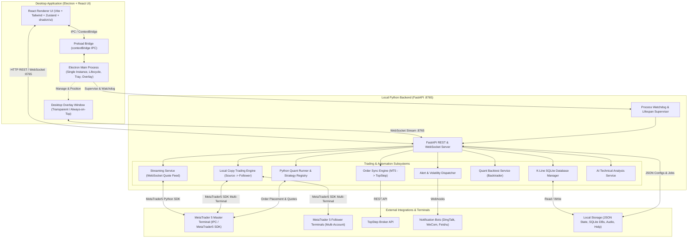

# MT5 Trader Workbench System Architecture & Directory Guide

MT5 Trader Workbench is a Windows-focused desktop trading workstation and automation assistant built with Electron, React, TypeScript, and a local Python FastAPI backend service. It interfaces with local MetaTrader 5 (MT5) terminals to provide real-time quote streaming, a frameless desktop quote overlay, multi-channel threshold and indicator alerts (DingTalk, WeChat Work, Feishu), automated order broadcasting, MT5-to-TopStep order synchronization, a local multi-account copy trading engine, quantitative Python strategy execution and historical backtesting (Backtrader), local SQLite K-line storage, and historical paper-trading replay.

---

## 1. System Overview & Architecture

- **Core Function & Scope**:
  - **Real-Time Market Monitoring**: Continuous background polling and WebSocket streaming of MT5 symbol prices, spread, account balance, equity, and margin levels.
  - **Desktop Quote Overlay**: Transparent, frameless, always-on-top ticker widget displaying live symbol quotes with configurable fonts, colors, and pinned symbols.
  - **Multi-Channel Alert Dispatcher**: Configurable price thresholds, sudden price volatility spikes, and RSI indicator conditions dispatched to desktop audio chimes, native toasts, and enterprise webhooks (DingTalk, WeCom, Feishu).
  - **Trading Performance & Analytics**: Comprehensive Order Center calculating daily, weekly, monthly, and historical trade statistics, win rate, profit factor, and holding durations.
  - **Order Synchronization & Broadcast**: Monitored MT5 trade execution events broadcasted to notification channels or replicated to TopStep broker accounts.
  - **Local Multi-Account Copy Trading**: Independent multi-source to multi-follower account pool management with configurable lot multiplier rules, symbol filtering, and isolated background execution loops.
  - **Python Quant Engine & Backtesting**: Live execution and Backtrader-driven backtesting for Python quantitative trading strategies using cached local SQLite market data.
  - **Historical Data & Paper-Trading Review**: Local SQLite K-line storage and candle replay environment for historical manual paper-trading simulations.
  - **AI Technical Analysis**: Multi-indicator synthesis generating multi-timeframe analysis reports (Wave Analysis, Price Action, SMC, Momentum).

- **System Topology Diagram**:



- **Core Subsystems / Modules**:
  1. **Electron Main Process & Desktop Shell (`src/main`)**: Manages the native application lifecycle, single-instance mutex enforcement, system tray menu integration, frameless desktop overlay window, and the Python backend child process lifecycle with automatic port cleaning and crash watchdogs.
  2. **React Frontend Application (`src/renderer`)**: Modern desktop interface built with Tailwind CSS and `shadcn/ui` components, managed by modular Zustand stores with full internationalization (English & Chinese) and responsive layout drawers.
  3. **FastAPI Local Backend Server (`python_service/app/main.py`)**: Asynchronous HTTP and WebSocket server operating on `http://127.0.0.1:8765`, coordinating concurrent background task loops for quote streaming, order synchronization, copy trading, and quantitative execution.
  4. **Multi-Account Registry & Copy Trading Subsystem (`python_service/app/local_copy_trading`)**: High-performance local multi-account trade replicator supporting master-follower account mapping, contract size conversions, lot multipliers, and safety stop boundaries.
  5. **Python Quant & Backtesting Engine (`python_service/app/quant`)**: Extensible quantitative strategy framework discovering user and built-in strategies, managing live strategy jobs against MT5, caching historical market data in SQLite, and executing Backtrader-based parameter backtests.
  6. **Real-time Market Data & Desktop Overlay (`src/main/overlay-window.ts`, `python_service/app/services/streaming_service.py`)**: Sub-second quote broadcast over WebSocket to a click-through or draggable desktop overlay ticker with custom fonts, colors, and pinned symbols.
  7. **Alert, Volatility & Risk Control Dispatcher (`python_service/app/services/alert_service.py`, `notifier_service.py`)**: Real-time evaluation of price thresholds, sudden price swings, and RSI indicators, triggering multi-tier audio chimes and external bot webhooks (DingTalk, WeCom, Feishu).
  8. **Data Management & Paper-Trading Review (`python_service/app/db/kline_db.py`, `routes/trading_review.py`)**: SQLite-backed historical OHLCV data repository and candlestick chart simulator for manual paper-trading replay.

---

## 2. Environment & Technical Stack Versions

| Subsystem | Technology / Component | Version Requirement / Specification |
| :--- | :--- | :--- |
| **Operating System** | Host OS Runtime | Windows 10 / Windows 11 (64-bit x64) |
| **Language Runtime (Node)** | Node.js Runtime | Node.js >= 20.x (LTS recommended) |
| **Language Runtime (Python)** | Python Interpreter | Python 3.10 - 3.12 (MetaTrader5 SDK compatible) |
| **Desktop Shell** | Electron Framework | Electron `^30.0.0` (with `@electron-toolkit/utils` `^4.0.0`) |
| **Frontend Framework** | React & React DOM | React `^18.2.0`, React DOM `^18.2.0` |
| **Frontend Routing** | Client-side Router | React Router DOM `^7.14.2` (`HashRouter`) |
| **State Management** | State Stores | Zustand `^4.5.2` |
| **UI Design System** | Tailwind CSS & Primitives | Tailwind CSS `^3.4.3`, Radix UI Primitives, Lucide Icons `^0.378.0` |
| **Data Visualization** | Financial Charting | TradingView Lightweight Charts `^5.2.0` |
| **Backend Web Framework** | Python Web Framework | FastAPI `>= 0.110.0`, Starlette |
| **ASGI Web Server** | Async Server | Uvicorn `>= 0.29.0` |
| **Data Validation** | Schema & Model Validation | Pydantic `>= 2.7.0` |
| **Broker SDK** | MetaTrader 5 SDK | MetaTrader5 Python Package `>= 5.0.45` |
| **Quantitative Backtesting** | Backtesting Engine | Backtrader `>= 0.2.4`, pandas, numpy |
| **Database & Storage** | Local Persistence Layer | SQLite 3 (`storage/kline_data.db`), JSON File Stores (`storage/*.json`) |
| **Build & Bundler** | Desktop Bundler | electron-vite `^2.1.0`, Vite `^5.2.10`, TypeScript `^5.4.5` |
| **Packaging Tools** | Executable & Installer Packager | PyInstaller (`python_service/mt5_service.spec`), electron-builder `^24.9.1` |
| **Frontend Testing** | Unit & Component Test Suite | Vitest `^1.5.0`, JSDOM `^24.0.0`, Testing Library React `^15.0.5` |
| **E2E & Desktop Testing** | Desktop Automation Test Suite | Playwright `^1.43.1` (`tests/e2e/app-launch.spec.ts`) |
| **Backend Testing** | Python Test Suite | Pytest `>= 8.0.0`, HTTPX (FastAPI TestClient) |

---

## 3. Comprehensive Directory Structure

```text
workbench-gemini/
├── .agents/                                        # AI Agent skills, rules, and assistant configuration
│   └── skills/                                         # Custom capability definitions and operational workflows
│       ├── code-quality-audit/                             # Code quality and architecture review skill
│       │   └── SKILL.md                                        # 9-dimension codebase audit guidelines
│       ├── coder/                                          # General coding and engineering skill
│       │   └── SKILL.md                                        # Best coding practices and implementation rules
│       ├── executing-plans/                                # Step-by-step implementation plan execution skill
│       │   └── SKILL.md                                        # Checkpointed execution workflow guidelines
│       ├── project-guide/                                  # Architecture guide maintenance and audit skill
│       │   ├── scripts/                                        # Directory tree generator and validation tooling
│       │   │   ├── check_guide_tree.py                             # Tree synchronization and discrepancy validator
│       │   │   └── generate_guide_tree.py                          # Automated markdown tree generator script
│       │   └── SKILL.md                                        # GUIDE.md specification and maintenance SOP
│       ├── requesting-code-review/                         # Code review request and verification skill
│       │   ├── code-reviewer.md                                # Review criteria and verification prompts
│       │   └── SKILL.md                                        # Review protocol and completion checklist
│       ├── using-superpowers/                              # Core skill discovery and dispatch framework
│       │   ├── references/                                     # Tool and environment reference definitions
│       │   │   ├── codex-tools.md                                  # Codex platform tool schema references
│       │   │   └── gemini-tools.md                                 # Gemini platform tool schema references
│       │   └── SKILL.md                                        # Superpower skill activation and dispatch rules
│       └── writing-plans/                                  # Multi-step implementation planning skill
│           ├── plan-document-reviewer-prompt.md                # Implementation plan review prompt template
│           └── SKILL.md                                        # Technical planning protocol and guidelines
├── .github/                                        # CI/CD workflow automation and repository configuration
│   └── workflows/                                      # GitHub Actions continuous integration and release workflows
│       └── release.yml                                     # Automated Windows build and release packaging workflow
├── python_service/                                 # Local Python FastAPI backend service and trading engine
│   ├── app/                                            # Backend application source code
│   │   ├── db/                                             # Local SQLite database abstraction layer
│   │   │   └── kline_db.py                                     # Historical K-line candlestick SQLite storage and sync manager
│   │   ├── local_copy_trading/                             # Local multi-account copy trading subsystem
│   │   │   ├── engine.py                                       # Copy trade signal processing and order execution engine
│   │   │   ├── follower_executor.py                            # Follower MT5 terminal trade placement and execution
│   │   │   ├── loop.py                                         # Asynchronous copy trading polling and execution loop
│   │   │   ├── models.py                                       # Pydantic data schemas for copy trading configurations
│   │   │   ├── routes.py                                       # REST API endpoints for copy trading management
│   │   │   ├── runtime.py                                      # In-memory copy trading state manager and runtime coordinator
│   │   │   ├── source_adapter.py                               # Source MT5 account trade event and position detector
│   │   │   └── storage.py                                      # Copy trading settings and relation persistence helper
│   │   ├── models/                                         # Shared Pydantic domain data models
│   │   │   ├── alerts.py                                       # Price, volatility, and indicator alert data models
│   │   │   ├── monitoring.py                                   # Account metrics and health monitoring schemas
│   │   │   ├── order_sync.py                                   # Order sync configuration and history models
│   │   │   ├── risk_control.py                                 # Risk parameters, drawdown limits, and safety models
│   │   │   ├── settings.py                                     # System configuration and bot credential models
│   │   │   └── technical_analysis.py                           # Technical analysis report request and response models
│   │   ├── quant/                                          # Python quantitative strategy execution & backtest engine
│   │   │   ├── strategies/                                     # Built-in quantitative trading strategies
│   │   │   │   ├── bollinger_breakout.py                       # Bollinger Bands volatility breakout strategy
│   │   │   │   ├── dual_thrust.py                              # Dual Thrust classic intraday range breakout strategy
│   │   │   │   ├── macd_trend.py                               # MACD momentum and trend following strategy
│   │   │   │   ├── rsi_reversal.py                             # RSI dynamic mean reversion strategy
│   │   │   │   ├── sma_cross.py                                # Fast/Slow Simple Moving Average crossover strategy
│   │   │   │   └── turtle_donchian.py                          # Turtle Donchian channel trend breakout strategy
│   │   │   ├── backtest_models.py                              # Backtesting parameters and performance metrics models
│   │   │   ├── backtest_routes.py                              # REST API endpoints for historical backtesting runs
│   │   │   ├── backtest_service.py                             # Backtrader-based strategy backtest execution service
│   │   │   ├── event_log.py                                    # Quant runtime log emission and event capture
│   │   │   ├── loop.py                                         # Live quant strategy polling and execution background loop
│   │   │   ├── market_data.py                                  # Local market data caching and MT5 backfill engine
│   │   │   ├── models.py                                       # Quant job configuration, parameters, and status models
│   │   │   ├── mt5_execution.py                                # Live MT5 order routing and position execution adapter
│   │   │   ├── paths.py                                        # Quant data, jobs, and strategy directory resolution
│   │   │   ├── routes.py                                       # REST API endpoints for live quant job management
│   │   │   ├── runtime.py                                      # Live quant strategy worker supervisor and job runtime
│   │   │   ├── storage.py                                      # Quant jobs and strategy registry persistence helper
│   │   │   └── strategy_registry.py                            # Dynamic strategy discovery from built-in and user paths
│   │   ├── routes/                                         # FastAPI HTTP and WebSocket router modules
│   │   │   ├── alerts.py                                       # Price, volatility, and indicator alert CRUD endpoints
│   │   │   ├── awakening.py                                    # Multi-source technical analysis report endpoints
│   │   │   ├── data_management.py                              # K-line historical data sync and query endpoints
│   │   │   ├── health.py                                       # Backend health check and readiness probe endpoint
│   │   │   ├── history.py                                      # Historical trade metrics and daily statistics endpoints
│   │   │   ├── mt5.py                                          # MT5 terminal connection, account, positions, and launch API
│   │   │   ├── notifications.py                                # Notification channel test and dispatch endpoints
│   │   │   ├── order_sync.py                                   # MT5 to TopStep order synchronization endpoints
│   │   │   ├── overlay.py                                      # Desktop quote overlay configuration and state API
│   │   │   ├── risk_control.py                                 # Account risk control limits and emergency rules API
│   │   │   ├── settings.py                                     # Application settings load, save, and migration endpoints
│   │   │   ├── stream.py                                       # WebSocket endpoint for real-time market quote streaming
│   │   │   └── trading_review.py                               # Historical paper-trading review and playback API
│   │   ├── services/                                       # Core business logic, MT5 integration, and notification services
│   │   │   ├── ai_technical_analysis_service.py                # Multi-indicator AI market analysis and synthesis
│   │   │   ├── alert_dispatch_service.py                       # Central alert evaluation and event dispatcher
│   │   │   ├── alert_service.py                                # Price and threshold alert matching logic
│   │   │   ├── awakening_service.py                            # Composite technical report generator (Wave, SMC, PA)
│   │   │   ├── history_service.py                              # MT5 order history retrieval and daily aggregation
│   │   │   ├── indicator_service.py                            # Technical indicator calculation (RSI, SMA, ATR)
│   │   │   ├── monitoring_service.py                           # Account balance, equity, and margin monitor
│   │   │   ├── mt5_service.py                                  # MetaTrader 5 Python SDK wrapper and connection manager
│   │   │   ├── notifier_service.py                             # DingTalk, WeCom, Feishu, and desktop alert dispatcher
│   │   │   ├── order_sync_service.py                           # Order sync engine matching MT5 orders to remote brokers
│   │   │   ├── quote_snapshot_service.py                       # Live market quote caching and symbol snapshot service
│   │   │   ├── risk_control_service.py                         # Max drawdown and margin risk rule enforcement
│   │   │   ├── streaming_service.py                            # WebSocket broadcast manager and quote feed loop
│   │   │   └── topstep_service.py                              # TopStep broker API integration and order bridge
│   │   └── main.py                                         # FastAPI server entrypoint with lifespan manager and watchdog
│   ├── mt5_service.spec                                # PyInstaller build specification for standard Windows backend
│   ├── mt5_service_hardened.spec                       # PyInstaller build specification for obfuscated backend
│   ├── pyproject.toml                                  # Python backend package metadata and dependency configuration
│   └── requirements.txt                                # Python package requirements for backend runtime
├── resources/                                      # Application static assets, icons, audio, and help documentation
│   ├── audio/                                          # Alert sound effect files
│   │   ├── 01.mp3                                          # Default notification chime sound effect
│   │   ├── 02.mp3                                          # High-priority warning alert sound effect
│   │   └── 03.mp3                                          # Critical threshold alarm sound effect
│   ├── help/                                           # Offline user guide documents bundled with the desktop app
│   │   ├── user-guide.en.html                              # English user guide and operational manual
│   │   └── user-guide.zh-CN.html                           # Chinese user guide and operational manual
│   ├── 128x128.ico                                     # 128x128 icon resource
│   ├── 16x16.ico                                       # 16x16 icon resource
│   ├── 32x32.ico                                       # 32x32 icon resource
│   ├── 48x48.ico                                       # 48x48 icon resource
│   ├── 64x64.ico                                       # 64x64 icon resource
│   ├── 96x96.ico                                       # 96x96 icon resource
│   ├── app-icon.ico                                    # Primary Windows application executable icon
│   ├── app-icon.png                                    # High-resolution application icon in PNG format
│   ├── icon.png                                        # Window header and branding icon asset
│   └── tray-icon.png                                   # System tray icon image asset
├── scripts/                                        # Build automation, icon generation, and verification scripts
│   ├── check-python-deps.ps1                           # PowerShell script to verify required Python environment packages
│   ├── generate-ico.cjs                                # Node.js script to generate multi-size .ico from PNG
│   ├── package-win.cjs                                 # Automated Windows installer packager with build versioning
│   ├── refactor_fetch.py                               # Python refactoring helper for API request migration
│   └── verify-packaging.ps1                            # PowerShell verification script for packaged backend and assets
├── src/                                            # Desktop application source code (Electron main, preload, and React renderer)
│   ├── main/                                           # Electron main process source code
│   │   ├── i18n.ts                                         # Main process localization strings (Window title, tray menu)
│   │   ├── index.ts                                        # Electron main entrypoint, window lifecycle, and IPC handlers
│   │   ├── overlay-window.ts                               # Frameless desktop quote overlay window manager
│   │   ├── packaging-paths.test.ts                         # Unit tests for packaging asset path resolution
│   │   ├── packaging-paths.ts                              # Packaged vs development resource path helper
│   │   ├── python-service.test.ts                          # Unit tests for Python backend process supervisor
│   │   ├── python-service.ts                               # Python backend process spawner, health checker, and killer
│   │   ├── shutdown-coordinator.test.ts                    # Unit tests for graceful application shutdown coordinator
│   │   └── shutdown-coordinator.ts                         # Coordinated shutdown controller for Electron and backend
│   ├── preload/                                        # Electron preload bridge scripts
│   │   └── index.ts                                        # Secure contextBridge exposure of Electron APIs to renderer
│   └── renderer/                                       # React renderer frontend application root
│       ├── src/                                            # React renderer UI application source code
│       │   ├── components/                                     # Reusable UI and layout components
│       │   │   ├── dashboard/                                      # Dashboard and trading cockpit sub-components
│       │   │   │   ├── position-table.tsx                          # Live MT5 open positions table with profit highlights and one-click close
│       │   │   │   └── watchlist-card.tsx                          # Real-time watchlist card with quick desktop overlay ticker pinning
│       │   │   ├── ui/                                             # shadcn/ui design system primitive components
│       │   │   │   ├── badge.tsx                                       # Status badge indicator component
│       │   │   │   ├── button.tsx                                      # Styled button component with variant support
│       │   │   │   ├── card.tsx                                        # Content card container with header and body
│       │   │   │   ├── checkbox.tsx                                    # Accessible checkbox input component
│       │   │   │   ├── dialog.tsx                                      # Modal dialog window and overlay component
│       │   │   │   ├── input.tsx                                       # Form text input component
│       │   │   │   ├── label.tsx                                       # Form input label component
│       │   │   │   ├── scroll-area.tsx                                 # Custom styled scroll area container
│       │   │   │   ├── select.tsx                                      # Dropdown select menu with search and options
│       │   │   │   ├── separator.tsx                                   # Visual horizontal and vertical divider
│       │   │   │   ├── sheet.tsx                                       # Slide-out panel container component
│       │   │   │   ├── sidebar.tsx                                     # Collapsible application sidebar component
│       │   │   │   ├── skeleton.tsx                                    # Loading placeholder skeleton component
│       │   │   │   ├── sonner.tsx                                      # Toast notification provider using Sonner
│       │   │   │   ├── switch.tsx                                      # Toggle switch input component
│       │   │   │   ├── table.tsx                                       # Styled data table with header and rows
│       │   │   │   ├── tabs.tsx                                        # Tabbed navigation container component
│       │   │   │   ├── textarea.tsx                                    # Multi-line text input area component
│       │   │   │   └── tooltip.tsx                                     # Hover tooltip popover component
│       │   │   ├── command-palette.tsx                             # Global command palette modal dialog with Ctrl+K shortcut
│       │   │   ├── module-nav.tsx                                  # Categorized sidebar navigation menu component
│       │   │   ├── page-header.tsx                                 # Standard page title and action header bar
│       │   │   ├── status-bar.tsx                                  # Global bottom status bar displaying MT5 connection and stream latency
│       │   │   └── trading-chart.tsx                               # Lightweight Charts candlestick and volume chart widget
│       │   ├── config/                                         # Frontend application configuration
│       │   │   └── developer.ts                                    # Developer contact and sponsorship metadata
│       │   ├── hooks/                                          # Custom React hooks
│       │   │   ├── use-alert-trigger-effects.ts                    # Hook for audio and desktop alert trigger effects
│       │   │   └── use-mobile.tsx                                  # Responsive mobile viewport detection hook
│       │   ├── i18n/                                           # Internationalization provider and translations
│       │   │   ├── index.tsx                                       # React I18n context provider and translation hook
│       │   │   └── messages.ts                                     # Complete English and Chinese localization dictionaries
│       │   ├── layouts/                                        # Application layout shell components
│       │   │   └── workbench-shell.tsx                             # Main workbench layout with sidebar and titlebar
│       │   ├── lib/                                            # Frontend utilities, API clients, and helper functions
│       │   │   ├── api.ts                                          # Central Axios/Fetch client for FastAPI backend endpoints
│       │   │   ├── local-copy-trading.ts                           # Local copy trading API client and helper functions
│       │   │   ├── python-quant.ts                                 # Python quant live jobs API client and helper types
│       │   │   ├── quant-backtest.ts                               # Quant backtest API client and execution helpers
│       │   │   └── utils.ts                                        # Tailwind class merging (clsx + tailwind-merge) utility
│       │   ├── pages/                                          # Application route view page components
│       │   │   ├── alerts/                                         # Unified alerts center workspace
│       │   │   │   └── AlertsCenterPage.tsx                        # Four-in-one alert console for price, volatility, indicators, and broadcast
│       │   │   ├── automation/                                     # Automation and copy trading workspace
│       │   │   │   └── AutomationCenterPage.tsx                    # Unified automation console for accounts, copy trading, sync, and risk
│       │   │   ├── quant/                                          # Quant lab and market review workspace
│       │   │   │   └── QuantLabPage.tsx                            # Strategy workshop, backtesting, historical replay, and AI report hub
│       │   │   ├── AccountListPage.tsx                             # MT5 multi-account management and status overview page
│       │   │   ├── dashboard-page.tsx                              # Workspace overview, live MT5 metrics, and quick actions page
│       │   │   ├── DataManagementPage.tsx                          # Historical K-line candlestick local sync and cache page
│       │   │   ├── EventLogPage.tsx                                # Real-time system activity and copy trading event log page
│       │   │   ├── IndicatorAlertsPage.tsx                         # RSI and technical indicator condition alert page
│       │   │   ├── LocalCopyTradingPage.tsx                        # Local multi-account copy trading rule and status page
│       │   │   ├── OrderBroadcastPage.tsx                          # Telegram/Webhook order broadcast notification rule page
│       │   │   ├── OrderCenterPage.tsx                             # Trading performance statistics and daily review page
│       │   │   ├── OrderSyncPage.tsx                               # MT5 to TopStep broker synchronization configuration page
│       │   │   ├── overlay-display-page.tsx                        # Floating desktop quote ticker overlay window page
│       │   │   ├── PriceAlertsPage.tsx                             # Price threshold alerts and trigger management page
│       │   │   ├── PythonQuantPage.tsx                             # Live Python quant strategy assignment and runner page
│       │   │   ├── QuantBacktestPage.tsx                           # Historical strategy backtesting and reporting page
│       │   │   ├── RiskControlPage.tsx                             # Account drawdown and maximum position risk control page
│       │   │   ├── SettingsPage.tsx                                # Application settings, connection, bot tokens, and theme page
│       │   │   ├── SponsorPage.tsx                                 # Developer donation and support page
│       │   │   ├── TechnicalAnalysisPage.tsx                       # Multi-module automated technical analysis report page
│       │   │   ├── TradingReviewPage.tsx                           # Historical paper-trading replay and review environment page
│       │   │   └── VolatilityPage.tsx                              # Rapid price change volatility alert configuration page
│       │   ├── stores/                                         # Zustand state management stores
│       │   │   ├── account-management-store.ts                     # Account pool state store for multi-account workflows
│       │   │   ├── alerts-store.ts                                 # Price, volatility, and indicator alert state store
│       │   │   ├── dashboard-store.ts                              # MT5 connection and account summary state store
│       │   │   ├── data-management-store.ts                        # Historical K-line sync status and storage store
│       │   │   ├── local-copy-trading-store.ts                     # Local copy trading rules and runtime event store
│       │   │   ├── order-store.ts                                  # Order history and daily performance statistics store
│       │   │   ├── order-sync-store.ts                             # TopStep order synchronization configuration store
│       │   │   ├── python-quant-store.ts                           # Python quant live job assignments and status store
│       │   │   ├── quant-backtest-store.ts                         # Quant backtest execution parameters and result store
│       │   │   ├── settings-store.ts                               # Application configuration and webhook settings store
│       │   │   └── trading-review-store.ts                         # Paper-trading simulation and playback state store
│       │   ├── styles/                                         # Global styles and Tailwind directives
│       │   │   └── globals.css                                     # Global CSS styles, theme CSS variables, and font settings
│       │   ├── test/                                           # Frontend unit and component test suite
│       │   │   ├── account-list-page.test.tsx                      # Component tests for Account List management page
│       │   │   ├── account-management-store.test.ts                # Unit tests for account management Zustand store
│       │   │   ├── alerts-center-page.test.tsx                     # Component tests for 4-in-1 AlertsCenterPage
│       │   │   ├── automation-center-page.test.tsx                 # Component tests for AutomationCenterPage
│       │   │   ├── dashboard-page.test.tsx                         # Component tests for Dashboard overview page
│       │   │   ├── i18n-provider.test.tsx                          # Unit tests for I18n translation provider and hooks
│       │   │   ├── local-copy-trading-page.test.tsx                # Component tests for Local Copy Trading UI
│       │   │   ├── local-copy-trading-store.test.ts                # Unit tests for local copy trading Zustand store
│       │   │   ├── module-nav.test.tsx                             # Component tests for 4+1 workspace ModuleNav
│       │   │   ├── order-broadcast-page.test.tsx                   # Component tests for Order Broadcast page
│       │   │   ├── order-center-page.test.tsx                      # Component tests for Order Center performance page
│       │   │   ├── order-sync-page.test.tsx                        # Component tests for Order Sync configuration page
│       │   │   ├── price-alerts-page.test.tsx                      # Component tests for Price Alerts management page
│       │   │   ├── python-quant-page.test.tsx                      # Component tests for Python Quant live runner UI
│       │   │   ├── python-quant-store.test.ts                      # Unit tests for Python quant Zustand store
│       │   │   ├── quant-backtest-page.test.tsx                    # Component tests for Quant Backtest execution UI
│       │   │   ├── quant-backtest-store.test.ts                    # Unit tests for quant backtest Zustand store
│       │   │   ├── quant-lab-page.test.tsx                         # Component tests for QuantLabPage
│       │   │   ├── risk-control-page.test.tsx                      # Component tests for Risk Control configuration UI
│       │   │   ├── settings-page-ai-config.test.tsx                # Component tests for AI settings configuration
│       │   │   ├── settings-page-bot-toggle.test.tsx               # Component tests for bot notification toggles
│       │   │   ├── settings-page-language.test.tsx                 # Component tests for UI language switcher
│       │   │   ├── settings-store.test.ts                          # Unit tests for application settings Zustand store
│       │   │   ├── setup.ts                                        # Vitest test setup, DOM extensions, and mock environments
│       │   │   ├── status-bar.test.tsx                             # Component tests for bottom StatusBar
│       │   │   ├── technical-analysis-page.test.tsx                # Component tests for Technical Analysis page
│       │   │   ├── trading-review-page.test.tsx                    # Component tests for Trading Review replay workspace UI
│       │   │   ├── trading-review-store.test.ts                    # Unit tests for Trading Review store and performance metrics
│       │   │   └── use-alert-trigger-effects.test.tsx              # Unit tests for alert sound and trigger effects hook
│       │   ├── App.tsx                                         # Renderer root component with HashRouter and theme provider
│       │   └── main.tsx                                        # React DOM entrypoint mounting App to root DOM element
│       └── index.html                                      # Main application HTML template entrypoint for Vite
├── storage/                                        # Local runtime data and configuration directory
│   ├── alerts.json                                     # Persisted price, volatility, and indicator alert definitions
│   ├── kline_data.db                                   # SQLite database caching historical K-line candlestick bars
│   ├── local_copy_trading.json                         # Persisted local copy trading account relationships and rules
│   ├── order_sync.json                                 # Persisted order synchronization parameters and credentials
│   ├── overlay_config.json                             # Persisted desktop quote overlay layout and symbol options
│   ├── risk-control.json                               # Persisted account risk control and loss threshold settings
│   └── settings.default.json                           # Default baseline application configuration template
├── tests/                                          # Automated end-to-end and integration test suites
│   ├── e2e/                                            # Playwright Electron end-to-end smoke tests
│   │   └── app-launch.spec.ts                              # Playwright smoke test validating Electron app startup
│   └── python/                                         # Python backend unit and integration test suite
│       ├── conftest.py                                     # Pytest test fixtures and FastAPI test client setup
│       ├── test_account_monitoring.py                      # Tests for account balance and margin monitoring service
│       ├── test_ai_technical_analysis_service.py           # Tests for multi-timeframe AI technical analysis service
│       ├── test_alert_dispatch_service.py                  # Tests for central alert evaluation and dispatching
│       ├── test_awakening_service.py                       # Tests for composite technical analysis report generator
│       ├── test_backend_lifespan.py                        # Tests for FastAPI lifespan startup and background tasks
│       ├── test_local_copy_trading_engine.py               # Tests for local copy trading order calculation engine
│       ├── test_local_copy_trading_follower_executor.py    # Tests for follower MT5 trade placement and execution
│       ├── test_local_copy_trading_lifespan.py             # Tests for copy trading background loop lifecycle
│       ├── test_local_copy_trading_models.py               # Tests for copy trading Pydantic model validation
│       ├── test_local_copy_trading_routes.py               # Tests for copy trading REST API endpoints
│       ├── test_local_copy_trading_runtime.py              # Tests for copy trading runtime state management
│       ├── test_local_copy_trading_source_adapter.py       # Tests for source MT5 trade event detection
│       ├── test_local_copy_trading_storage.py              # Tests for copy trading configuration persistence
│       ├── test_mt5.py                                     # Tests for MT5 terminal connection and error handling
│       ├── test_mt5_polling.py                             # Tests for MT5 polling and health check intervals
│       ├── test_mt5_service.py                             # Tests for MT5 SDK wrapper, quote fetching, and order actions
│       ├── test_notifications_routes.py                    # Tests for notification test dispatch API endpoints
│       ├── test_order_broadcast_alerts.py                  # Tests for order broadcast notification triggers
│       ├── test_order_sync_service.py                      # Tests for MT5 to TopStep order synchronization service
│       ├── test_overlay_control.py                         # Tests for desktop overlay window visibility controls
│       ├── test_overlay_persistence.py                     # Tests for overlay settings persistence and loading
│       ├── test_overlay_routes.py                          # Tests for overlay configuration REST API endpoints
│       ├── test_price_alerts.py                            # Tests for price alert threshold triggers and validation
│       ├── test_quant_backtest_routes.py                   # Tests for quant backtesting REST API endpoints
│       ├── test_quant_backtest_service.py                  # Tests for Backtrader historical backtest execution
│       ├── test_quant_event_log.py                         # Tests for quant strategy runtime event logging
│       ├── test_quant_lifespan.py                          # Tests for quant runner background loop lifecycle
│       ├── test_quant_market_data.py                       # Tests for local SQLite market data caching and backfill
│       ├── test_quant_models.py                            # Tests for quant job and strategy parameter models
│       ├── test_quant_routes.py                            # Tests for quant strategy job management REST endpoints
│       ├── test_quant_runtime.py                           # Tests for live quant strategy worker and execution runtime
│       ├── test_quant_storage.py                           # Tests for quant job and strategy persistence
│       ├── test_quant_strategies_execution.py              # Tests for built-in quantitative strategy execution and signals
│       ├── test_quant_strategy_registry.py                 # Tests for dynamic quant strategy discovery
│       ├── test_quote_snapshot_service.py                  # Tests for real-time market quote snapshot caching
│       ├── test_risk_control_routes.py                     # Tests for risk control configuration REST API
│       ├── test_risk_control_service.py                    # Tests for account drawdown and safety rule enforcement
│       ├── test_settings.py                                # Tests for application settings persistence and migration
│       ├── test_streaming_service.py                       # Tests for WebSocket market quote streaming service
│       ├── test_technical_analysis_routes.py               # Tests for technical analysis report generation API
│       ├── test_trading_review.py                          # Tests for trading review replay lifecycle, contract math, and SL/TP triggers
│       └── test_volatility_alerts.py                       # Tests for rapid price movement volatility alerts
├── AGENTS.md                                       # AI coding agent guidelines, architecture quirks, and command specifications
├── build-hardened.bat                              # One-click Windows batch script for hardened Pyarmor build
├── build-standard.bat                              # One-click Windows batch script for standard packaging build
├── components.json                                 # shadcn/ui CLI component library configuration
├── electron.vite.config.ts                         # electron-vite multi-bundle build configuration
├── GUIDE.md                                        # System architecture & directory guide (this file)
├── LICENSE                                         # License terms and legal agreement
├── package-lock.json                               # npm dependency lockfile
├── package.json                                    # Node.js dependencies and script manifests
├── postcss.config.js                               # PostCSS configuration for Tailwind CSS processing
├── README.md                                       # Primary product documentation & user guide
├── README.zh-CN.md                                 # Chinese product documentation and user guide
├── RELEASE_NOTES.md                                # Product release notes and changelog summary
├── tailwind.config.ts                              # Tailwind CSS theme tokens and layout configuration
├── tsconfig.json                                   # TypeScript compiler configuration for renderer code
├── tsconfig.node.json                              # TypeScript compiler configuration for Node/Electron main code
├── vite.config.ts                                  # Standalone Vite configuration file
└── vitest.config.ts                                # Vitest configuration for unit and component testing
```

---

## 4. Deep Dives: Core Subsystems / Modules

### 4.1 Electron Main Process & Process Lifecycle Management
- **Single Instance Mutex**: `src/main/index.ts` acquires a single-instance lock (`app.requestSingleInstanceLock()`). Secondary launches focus the primary window and exit.
- **Python Backend Supervision**: `src/main/python-service.ts` spawns `python_service/dist/mt5_service/mt5_service.exe` in production or `python -m python_service.app.main` in development. It attaches `PARENT_PID` environment variables for watchdog liveness and probes `http://127.0.0.1:8765/health` until healthy before displaying the main window.
- **Coordinated Shutdown**: `src/main/shutdown-coordinator.ts` intercepts close events, hides to tray by default, and coordinates clean termination of the backend server (releasing MT5 terminal connections and file locks) before quitting.
- **Desktop Overlay Window**: `src/main/overlay-window.ts` manages a transparent, frameless, always-on-top BrowserWindow loading the `#/overlay-display` route.

### 4.2 React Renderer & State Architecture
- **Navigation & Routing**: `src/renderer/src/App.tsx` configures `HashRouter` to manage 18+ application views within `src/renderer/src/layouts/workbench-shell.tsx`.
- **shadcn/ui Component Library**: Standardized accessible primitives located in `src/renderer/src/components/ui/` (buttons, dialogs, dropdown selects, tooltips, collapsible sidebars, tables).
- **Zustand Modular Stores**: `src/renderer/src/stores/` separates domain concerns:
  - `account-management-store.ts`: Shared account pool for copy trading and quant strategies.
  - `alerts-store.ts`: Price, volatility, and indicator alert state and active triggers.
  - `dashboard-store.ts`: Connection status, balance, equity, and margin levels.
  - `local-copy-trading-store.ts`: Source/follower mapping, lot multipliers, and event logs.
  - `python-quant-store.ts`: Strategy job assignments, status toggles, and backfill progress.
  - `quant-backtest-store.ts`: Backtesting parameter state and historical report results.
  - `settings-store.ts`: MT5 paths, theme preferences, and DingTalk/WeCom/Feishu tokens.
  - `trading-review-store.ts`: Paper-trading historical playback timeline and open positions.
- **Internationalization (i18n)**: `src/renderer/src/i18n/` delivers reactive instant language switching between English and Simplified Chinese across all components and toast notifications.

### 4.3 FastAPI Local Backend Service & Background Loops
- **Lifespan Manager (`python_service/app/main.py`)**: Initializes database schemas, loads persisted state, starts background worker tasks, and shuts down MT5 connections on exit:
  - `streaming_loop()`: Polls symbol ticks and broadcasts quotes to WebSocket subscribers.
  - `order_sync_loop()`: Monitors MT5 orders and executes remote TopStep broker synchronization.
  - `local_copy_trading_loop()`: Polls master MT5 account orders and replicates them to follower accounts.
  - `quant_loop()`: Executes active Python quant strategy instances.
  - `parent_process_watchdog()`: Automatically terminates the backend if the parent Electron process dies.
- **API Routing Matrix**:
  - `/health`: Readiness probe and backend diagnostics.
  - `/mt5/*`: MT5 connection status, terminal launch, account details, and open positions.
  - `/alerts/*`: Price alerts, volatility alerts, and indicator alerts CRUD.
  - `/notifications/*`: Test webhook and toast notification dispatch.
  - `/stream`: WebSocket endpoint for high-frequency live symbol price streaming.
  - `/order-sync/*`: Order synchronization configuration and execution logs.
  - `/local-copy-trading/*`: Multi-account copy trading rules, status, and event history.
  - `/quant/*`: Quantitative strategy registry, job management, and market data backfill.
  - `/quant/backtest/*`: Historical backtesting execution and performance reporting.
  - `/data-management/*`: Local K-line synchronization and historical data queries.
  - `/trading-review/*`: Manual paper-trading session simulation and replay.

### 4.4 Local Multi-Account Copy Trading Subsystem
- **Source Adapter (`python_service/app/local_copy_trading/source_adapter.py`)**: Detects trade events (new orders, position closures, stop loss / take profit modifications) on designated master MT5 accounts.
- **Follower Executor (`python_service/app/local_copy_trading/follower_executor.py`)**: Maps source symbol names to follower symbol naming conventions, computes lot sizes according to multiplier rules (fixed lot, equity ratio, or balance multiplier), and places trades on follower MT5 instances.
- **Safety Boundaries**: Enforces max position sizes, slippage limits, and execution confirmations to prevent accidental catastrophic drawdowns.

### 4.5 Python Quant Engine & Backtesting
- **Strategy Registry (`python_service/app/quant/strategy_registry.py`)**: Dynamically discovers strategy classes implementing the standardized Strategy interface from built-in directories (`python_service/app/quant/strategies/`) and user directories (`storage/python_quant/strategies/`).
- **Market Data Cache (`python_service/app/quant/market_data.py`)**: Downloads and caches historical OHLCV data into local SQLite databases (`storage/python_quant/market_data.sqlite3`), eliminating redundant network requests.
- **Backtrader Execution (`python_service/app/quant/backtest_service.py`)**: Runs historical simulations against cached data, calculating Total Return, Max Drawdown, Sharpe Ratio, Profit Factor, and trade timelines.

### 4.6 Real-Time Market Data, Desktop Overlay & Alert Dispatch
- **WebSocket Streaming**: `python_service/app/services/streaming_service.py` broadcasts real-time ticks to the desktop overlay and renderer charts.
- **Desktop Overlay**: An always-on-top, click-through or interactive mini-ticker displaying user-selected instruments with real-time bid/ask updates.
- **Multi-Channel Alert Dispatch**: `python_service/app/services/notifier_service.py` signs and posts payload notifications to DingTalk, WeChat Work (WeCom), and Feishu webhooks, while playing native audio chimes (`01.mp3`, `02.mp3`, `03.mp3`).

---

## 5. Build, Development & Execution Workflows

### 5.1 Environment Setup

1. **Install Node.js Dependencies**:
   ```bash
   npm install
   ```

2. **Install Python Backend Dependencies**:
   ```bash
   python -m pip install --upgrade pip
   python -m pip install -r python_service/requirements.txt
   ```

### 5.2 Development Execution

Start the full Electron desktop app with live reload and local backend:
```bash
npm run dev
```

*In development mode, Electron launches `python -m python_service.app.main` on port `8765` and hot-reloads renderer changes via `electron-vite`.*

### 5.3 Automated Testing & Quality Assurance

- **Run Frontend & Main Process Vitest Tests**:
  ```bash
  npm run test:frontend
  ```

- **Run Python Backend Pytest Suite**:
  ```bash
  pytest tests/python
  ```

- **Run Electron Desktop E2E Smoke Tests** *(requires building frontend first)*:
  ```bash
  npm run build
  npm run test:electron
  ```

- **Verify Architecture Guide Tree Alignment**:
  ```bash
  python .agents/skills/project-guide/scripts/check_guide_tree.py
  ```

### 5.4 Production Build & Packaging Workflows

1. **Standard Windows Packaging**:
   ```bash
   npm run package:win
   # Or execute the one-click batch script:
   build-standard.bat
   ```
   *Execution Pipeline:*
   - `npm run build`: Compiles main, preload, and renderer bundles via `electron-vite`.
   - `npm run build:python`: Bundles Python backend into `python_service/dist/mt5_service/` with `PyInstaller`.
   - `npm run verify:packaging`: Validates backend binary, `_internal` runtime, help manuals, and extraResources.
   - `node scripts/package-win.cjs`: Auto-increments local build version in `.build-version.json` and invokes `electron-builder` to generate the Windows installer in `dist/`.

2. **Hardened / Protected Build Packaging**:
   ```bash
   npm run package:win:hardened
   # Or execute the one-click batch script:
   build-hardened.bat
   ```
   *Uses Pyarmor to obfuscate Python source code prior to PyInstaller compilation.*
